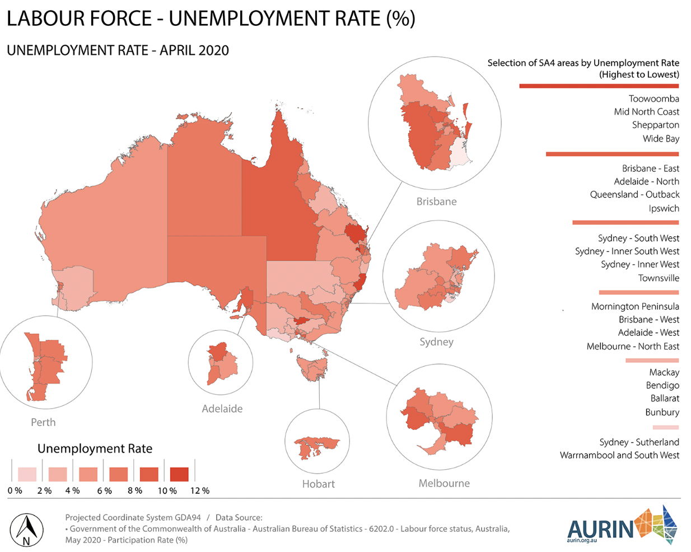
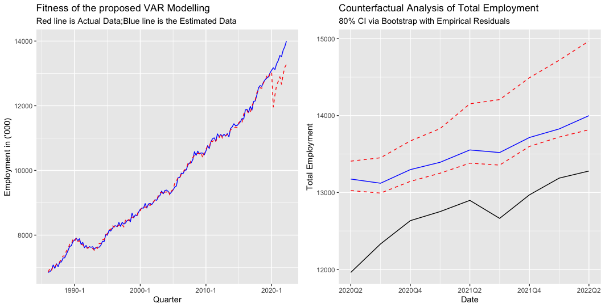

```{r setup, include=FALSE}
knitr::opts_chunk$set(echo = FALSE)
library(tidyverse)
```

```{r titleslide, child="components/titleslide.Rmd"}
```

---
# Background 

<br>


.grid[

<div style="font-size:18pt">
<h2>Health threats</h2>
<p>
<b style="font-size:24pt">Life impacts (till last week)</b><br>
6.07 million people infected and 7355 people have died. There are many short-term and long-term adverse effects on people who get covid-19. <br>
<br>
<b style="font-size:24pt">Economic impacts</b><br>
Australia has lost billions of money because of the pandemic. In 2020, 72% of businesses generated much lower revenue than before. Moreover, the job losses have reached 1.6 million jobs lost in two weeeks after the global pandemic was announced. The underemployment rate hit historically high with 13.8% by the end of April, 2020. 
</p>
</div>




]


---
# Research Aim 

__The overall research aim is to evaluate the employment effects of COVID-19 via developing a model for the two-digit subsectors (<u>87 totally</u>) .  __ 

<small style="font-size:14pt"> I'm also trying to solve the following tasks: </small>


--

+ To construct a time series multivariate model of employment in 87 subsectors of the Australian economy. 

--

+ To use this model to conduct a contrafactual analysis 

--

+ To use this model to determine which sectors have the highest impact (or positive spillover) on employment growth. 


---
# Review of Literature 
# Sectoral studies of COVID-19:


.font_my_2[

+ At a worldwide level, International Labor Organisation provided some initial estimates and concluded the "Accommodation & Food services", "Real Estate, Business,& Administrative Activities", "Manufacturing", and "Wholesale & Retail Trade" as high risk sectors. 
 

+ In US, <small style="font-size:13pt">Ludvigson,Ma, and Ng (2020)</small> developed a costly disaster model to translate the impacts of deadly disasters in recent US history and modeled as shocks to predict the COVID-19 influences.  <small style="font-size:13pt">Gregory, Menzio, and Wiczer (2020)</small> expand some Model-based analysis of the disaggregate impacts of 20 sectors. 


+ In France, <small style="font-size:13pt">Barrot, Grassi and Sauvagnat (2020)</small> estimated the impacts at sectoral level. They then use a production network model to estimate the drop of total GDP and sectoral performances. 


]

--
### Limitation:

However, not many studies have done in Australia (as a small open economy nothing like US, Europe).


---
# Review of Literature

<br>

<br>

.grid[
.font_my_2[

### An Aussie story begins:
+ Anderson et al. (2020) conducted a multivariate time series Bayesian VARX model for 19 board sectors in Australia. Their research conducted in 2020 at the time full of uncertainty. Therefore, they applied an "conditional forecasting" method to simulate different scenarios for the sectoral employment in Australia during the pandemic. 


### Limitation:

Some useful information about macroeconomic analysis <u>has been ignored </u> due to the differences in 19 (Board level) sectors and 87 (Two-digit level) sectors. 


]

.font_my_2[


]

]


---

# Exploratory Data Analysis


+ **Don't judge them by their appearances**


<small style="font-size:13pt">Here is the reason why we expand Anderson et al. (2020) to a two-digit level. See the differences :-) </small> <small style="font-size:13pt">If we stimulate a industry at a board sector level, our policy may **lack of efficiency**. </small>


<br>

.grid[


]


<br>


---
# Exploratory Data Analysis


<!-- This is not a single case, just be aware that there are many two-digit sectors performs differently. -->


---
# Project Design (Data)

## Data Sources: 

.font_my_2[

+ Number of Employment by Industry at subdivision (i.e. subsector) level: Retrived from [ABS Labour Force, Australia, Detailed](https://www.abs.gov.au/statistics/labour/employment-and-unemployment/labour-force-australia-detailed/latest-release)

]


## Supplimentary Data 

.font_my[

+ **Total Labour Force**: Australian Bureau of Statistics ABS(2022a)

+ **Unemployment Rate**: Australian Bureau of Statistics ABS(2022b)

+ **"Jobkeeper" Payments by Industry**: It contains four datasets for two phrases. 

]

.font_my_2[

1. [ABS Government support for businesses](https://www.abs.gov.au/articles/government-support-business) for the first phrase;

2. [ABS Government support for businesses , Sep 2020](https://www.abs.gov.au/articles/government-support-business-september-quarter-2020) ; [ABS Government support for businesses, Dec 2020](https://www.abs.gov.au/articles/government-support-business-september-quarter-2020); [ABS Government support for businesses, Mar 2021]( https://www.abs.gov.au/articles/government-support-business-march-quarter-2021) for the second phrase. 

]

---
#Project Design (Data)

## Data Wrangling 

<br>

.font_my[

①:An **logarithm** and a **seasonal difference **will be conducted to eliminate the seasonality and make it **stationary**, which will make it easier to conduct further steps. 

]

--

.font_my[

②:Merge the two-digit subsector *57- Internet Publishing and Boardcasting`* and *54- Publish-ing(except internet)* to a combined sector called *54 Publishing and boadcasting*. 

]

--
.font_my[

③:Combine the *96Private Households Employing Staff and Undifferentiated Goodsand Service Producing Activities of Households for Own Use* and *95 Personal and Other Services* as *95 Personal and other services (include activities for own use)*.


]


---
# Project Design (Data)


<br>

+ **Why don't I use the seasonally adjusted data ?**
--
.font_my_2[

+ Seasonally adjusted sectoral data in ABS do not add up seasonally adjusted total employment. There is no evidence of how they process the data so it will be problematic if we use it. I CANNOT make reliable evaluation !!! 

+ All new changes are expressed in terms of the raw figures.  
]

--


+ **The Non-classified Data**

--
.font_my_2[

+ We found there is no further direction to classify the data. Therefore, to make sure the individual dynamics more consistent, we will abandon them. 


]


---
class:center
# Project Design (Modelling)
##Bayesian Inference in VAR modelling

.font_my[
+ **Bayesian inference** derives the posterior probability as a consequence of two antecedents: a *Prior Probability* and a *Likelihood Function* derived based on the observed data.]

.font_my_2[
+ We can think of Bayesian Estimation as $Posterior = Prior\times Likelihood$ ]

$$P(H|E)=\frac{P(E|H).P(H)}{P(E)}$$
.font_small[
**where: H is hypothesis, E is evidence by data. P(H) is prior assumption, P(H|E) is posterior, P(E|H) is likelihood, P(E) is the the marginal likelihood ("model evidence")**  
]

.font_my[

+ We can bring our beliefs (priors) to the parameter. After seeing the data (likelihood), we get the posterior by combining the likelihood and the prior together.

]

<!-- .font_my[ -->


<!-- ] -->


---

# Project Design (Modelling)

+ **Bayesian Vector Autoregression**(BVAR) is a useful model to estimate a large number of parameters (while sample size is small) in a statistically coherent way. <small style="font-size:14pt">(Anderson et al.,2020;Litterman, 1986;Bańbura,Giannone,&Reichlin,2010)</small>


$$\textbf{y}_t=\textbf{c}+\textbf{A}_1 \textbf{y}_{t-1}+\bf{\Gamma}\textbf{x}_{t-1}+\bf{u}_t$$
.font_small[
**where:**  
]


.font_my_2[

+ $\bf{y}_t$ is an $85\times1$ vector of two-digit subsectoral employment growth rate at time $t$ with $\bf{A}_{1}$ are $85\times85$ parameter matrices. There are one lag of growth rate due to the high dimensionality and small sample size. 

+ $x_{t-1}$ is a scalar of one lag of the growth rate of total employment with $\bf{\Gamma}$ is $85\times1$ parameter matrices, which act as economy-wide factors. 

+ Reduced form errors $\bf{u}_t \sim (0,\bf{\Sigma})$. 

]


---
# Project Design (Prior Selection)

.font_my_2[
<b>Aim</b>: We use Minnesota prior to shrink the unrestricted model towards a naive benchmark, thereby reducing the parameter uncertainty and improving forecast accuracy. <small style="font-size:11pt">(Anderson et al.,2020;Litterman,    1986;Bańbura,Giannone,&Reichlin,2010;Karlsson,2013)</small>  

]


.font_my_2[

<br>

<b>Benefits</b>:  
 
  a. Eliminate <u>high-dimensionality</u> curse. 
  
  b.  It makes the most <u>recent lag</u> provide more information than distant lags. 
  
  c. It makes <u>own lags</u> explain more than the lags of other variables.
  
]

<br>
  
.font_my_2[
<b>Apply</b> : I will apply it in the BVAR system by creating a Normal- Inverse-Wishart prior (which retain the principal of Minnesota prior) and then adding dummy observations to put the posterior moments of Normal IW prior inside our BVAR system. <small style="font-size:11pt">(Bańbura,Giannone, and Reichlin (2010))</small> 

]

---

# Project Design (Details)

<b>Mean</b>:

.font_my_2[
 $$E[a_{i}^{jk}] = E[\gamma_{i}^j]=0$$

] 


**Variances**:
--
.font_my_2[
 For the lag of growth rate:

$$Var[a_i^{jk}]=\frac{\lambda^2}{i^2},j=k$$


$$Var[a_i^{jk}]= \frac{\lambda^2}{i^2}\frac{\sigma^2_j}{\sigma^2_k}, otherwise$$

 
 For the lag of total employment:

$$Var[\gamma_i^{j}]=\frac{\lambda^2}{i^2}\frac{\sigma^2_j}{\sigma^2_e}$$
]


.font_small[

<u><b>Note</b></u>: $\lambda$ control the overall tightness(variance of prior distribution); $\frac{1}{i^2}$ downweights distant lags; $\frac{\sigma_j}{\sigma_k}$ adjusts for different scales. 


]


 <!-- If $\lambda\rightarrow0$, we can see that the prior assumption is influential, which means that the posterior getting closer to the prior, so the data have no influence on the estimates. On the contrary, if $\lambda\rightarrow\infty$, the posterior expectations will approach to ordinary least squares (OLS) estimates. In many macroeconomic VAR forecasting, data are presented in a large dimension. As the dimension increases, we want to shrink more in order to avoid the over-fitting [@de2008] -->


---
# Project Design (Modelling)
# A new approach in selecting hyperparameter $\lambda$

.font_my_2[

+ Conventional error measurements (e.g. MAE, MSE or MAPE) are no longer robust when sizes of subsectors are small with various scales. 

]

.font_my_2[

+ We minimising a new error measurement "Root Mean Squared Forecast Error" via an out-of-sample forecasting experiment algorithm. ]


$$RMSFE^{(\lambda,m)}_{i,h}=\sqrt{\frac{1}{T_e-T_b-h}\Sigma^{T_{e}-h}_{T=T_{b}}({y}_{i,T+h|T}^{(\lambda,m)}-y_{i,T+h})^2}$$


.font_small[ 

+ where ${y}_{i,T+h|T}^{(\lambda,m)}$ is defined as the $h$-th steps ahead forecast given the information up to time $T$ and $y_{i,T+h}$ is the actual data for the $h$-th steps ahead forecast. Here, $m$ and $\lambda$ stands for the evaluated RMSFE, conditioned on a specific model and the hyperparameter $\lambda$. 

]


---
class:center
# Project Design (Modelling)
# Diagram of the proposed approach


.font_my_2[

+ From 3000 different combinations $\lambda$ from 0.0001 to 0.3, we found the $\lambda=0.0808$ has the lowest RMFSE. 


] 

---
# Empirical Results (Sectoral Multiplier Analysis)


.grid[

.font_my_2[

<br>


#### Background

The total employment growth is: 

$$GR_T=\sum_{j=1}^{87} w_j\times {GR}_j$$

<small style="font-size:12pt">(where $w_j$ is the share of employment of two-digit sector $j$ in the total employment and  $GR_j$  is the growth rate in employment of two-digit sector j and  $GR_T$  is the growth rate in total employment )</small>

📈 Due to the interconnection of macroeconomic two-digit subsectors, when a two-digit subsector $j$ has an increase in employment, in the long run, it may have spillover effect onto other two-digit subsectors, especially those that have high connections with the two-digit subsector $j$. 

]


.font_my_2[

<br>

<br>

<ul><b>Why it is useful?:</b></ul>

+ This will take the <u>structure of industries</u> into consideration, which is more closer to the reality. It also allows us to assess the damage of COVID-19 to these industries.  

+ This will help us to evaluate and improve the efficiency. For example, if policies simulate these subsectors, there will be a *bonus* and then we can say <u>"a dollar to these high spillover industries is more valuable than a dollar"</u>

]
]


--- 
class: center
# Empirical Results (Sectoral Multiplier Analysis)
## Long run employment multipliers


.font_my_2[

+ We find that `Other Store-Based Retailing` will generate the strongest positive spillover to the whole economy, followed by `Administrative Services`, `Furniture and Other Manufacturing`. They belongs to the `Retailing`, `Administrative and Support Services` and `Manufacturing` sectors in the broadest level respectively.

]


---
# Example


.grid[

.font_my_2[

<br>


## Positive spillover scenario:

It's interesting to see that `Gambling` have the positive spillovers. What may happened in this subsector? 


#### Answers: 

+ An appropriate reason could be that the `Gambling` are closely connected with many other subsectors (e.g. Retailing, Services etc). 

+ As a result, if a policy has an immediate effect on increasing the employment in the house construction industry. In the long run, the total employment will rise more than the immediate effect for house construction industry due to the indirect effect on glass and wood manufacturing industry, which has also have a positive impact on the total employment. 

]
.font_my_2[

<br>


]

]


---
# Empirical Results (Evaluation after COVID-19)
## Losses of total employment after COVID-19


```{r out.width="80%", fig.align='center'}

```

--
.font_my_2[

+ Huge losses of employment compare with the no-COVID scenario.

+ The parallel trend shows that the growth rate is similar. However, it also shows that the influences of COVID still cannot recover in a foreseen future. 

]


---
# Empirical Results (Evaluation after COVID-19)
## Changes of year-on-year growth rate


```{r out.width="60%", fig.align='center'}
knitr::include_graphics("figure/yoy1.png" )
```

--

.font_my_2[

+ The year-on-year growth gradually recovered after the shock. 

+ The impact of COVID-19 cannot recover in a short-term (unless there is a higher year-on-year growth in the future.) 

]


---
# Empirical Results (Unemployment Rate)


.grid[

.font_my_2[

<br>


## Historically Lowest Unemployment:

Australia has recorded the lowest unemployment level in 48 years. What is the underlying of this when **YOU** said we are still recovering? 


$$U_{emp}=\frac{T_L-T_E}{T_L}$$
.font_small[
where $U_{emp}$ is the unemployment rate; $T_L$ is the total labour force; $T_E$ total employed people.
]

**Drivens of low unemployment rate** : 

+ Lower labour force (Or the labour force decreasing faster than employment increasing)

+ Higher Employed People (Or the labour force decreasing slower than the employment increasing)


]
.font_my_2[

<br>


]

]


---
# Empirical Results (Evaluation after COVID-19)


```{r out.width="80%", fig.align='center'}
knitr::include_graphics("figure/con_labourf.png" )
```


.font_my_2[

+ We see that the total labour force has declined significantly compare with no-COVID case. 

+ Overall, the finding suggests the low unemployment rate is not an indication of recovering. 

]


---
# Empirical Results (Unemployment Rate)


```{r out.width="80%", fig.align='center'}
knitr::include_graphics("figure/cont_rate.png" )
```

---
# Which Sectors have government actually stimulated 

```{r out.width="80%", fig.align='center'}

```


---
# Discussions
## Policy Implications

+ More appropriate policies should be targeted to those high-spillover subsectors instead of focusing on a broader levels. 

+  The micro businesses also play important roles in economic recovery. While supporting the large-share sectors, it is essential for the government to pay attention to the micro businesses.


---

# Discussions
## Summary

+ There is no evidence that the pandemic can be controlled or prevented thoroughly but lives together with humans.


---
# Extensions

+ To improve the forecast accuracy, machine learning algorithms or combination forecasts can be considered for accurate and interpretable forecasts. 

<br>
--

+ To make our analysis more broad and easily accessible by researchers or government. An interactive shiny application can be implemented to give a more accessible way and thus benefit more people.

<br>
--

+ Bring more hierarchies to our analysis and make forecasts coherent using the hierarchical forecasting methods. 


<br>
---
class: center
# 👨‍🏫 SPECIAL 👨‍💻 THANKS 👩‍🏫
<br>

<br>


.monash-blue[I would like to gratitude my supervisor, 

**Farshid Vahid**, for your patient and selfless guidance.]

<br>

.monash-blue[I would also appreciate **Heather Anderson** for your devoted care along the journey.]

<br>

.monash-blue[Special thanks to  **Benjamin Wong** for offering kind supports and the MATLAB packages.]


---
<b>Figure Source</b>
.font_small[

covid image1: https://humanrights.gov.au/our-work/childrens-rights/publications/impacts-covid-19-children-and-young-people-who-contact-kids

covid image2: https://aurin.org.au/covid-and-employment/

covid image3: https://www.forbes.com/sites/advisor/2020/04/14/coronavirus-concerns-will-less-income-or-job-loss-hurt-your-credit-score/?sh=648c744e4dc4

Front page Data Source: The first year of COVID-19 in Australia: direct and indirect health effects, Summary - Australian Institute of Health and Welfare. (2022). Retrieved 8 May 2022, from https://www.aihw.gov.au/reports/burden-of-disease/the-first-year-of-covid-19-in-australia/summary

fence:https://canberraweekly.com.au/best-fencing-contractors/

window maker: https://www.bizjournals.com/tampabay/news/2020/02/05/pgt-completes-92m-acquisition-of-tampa-based-door.html

Unemplyment: Marsh, S. (2022). Australia's unemployment rate plummets to lowest level in 48 years. Retrieved 2 October 2022, from https://www.9news.com.au/national/australia-unemployment-rate-july-2022-lowest-rate-since-august-1974/d16e2bac-c9f1-435f-ad25-cb2964d292f0 


]

<b>Major references</b>

.font_small[

ABS. (2021). One year of covid-19: Aussie jobs, business and the economy. Retrieved April 29, 2022, from https://www.abs.gov.au/articles/one-year-covid-19-aussie-jobs-business- and-economy

Anderson, H, Caggiano, G, Vahid, F, & Wong, B. (2020). Sectoral employment dynamics in australia and the covid-19 pandemic. Australian Economic Review, 53(3), 402–414.


Bańbura, M, Giannone, D, & Reichlin, L. (2010). Large bayesian vector auto regressions. Journal of applied Econometrics, 25(1), 71–92.


International Labour Organization 2020. ILO Monitor: Covid‐19 and the World of Work.

Karlsson, S. (2013). Forecasting with Bayesian vector autoregression. Handbook of economic forecasting, 2, 791-897.

Kadiyala, KR, & Karlsson, S. (1997). Numerical methods for estimation and inference in bayesian var-models. Journal of Applied Econometrics, 12(2), 99–132.

Litterman, RB. (1986). Forecasting with bayesian vector autoregressions—five years of experience.Journal of Business & Economic Statistics, 4(1), 25–38.

]
---


```{r endslide, child="components/endslide.Rmd"}
```


---
class: center
#APPENDIX (Bayesian VAR)

.font_my_2[
$$\begin{align}
\textbf{y}_t&=\textbf{c}+\textbf{A}_1 \textbf{y}_{t-1}+\textbf{A}_2+\cdots+\textbf{A}_4\textbf{y}_{t-4}+\bf{\Gamma}_1\textbf{x}_{t-1}+\bf{u}_t\\
&=
\begin{bmatrix}
c_1\\
\vdots\\
c_2
\end{bmatrix}
+
\begin{bmatrix}
a_1^{11}&\cdots&a_1^{1n}&\cdots&a_4^{11}&\cdots&a_4^{1n}&\gamma_1^{1}&\cdots&\gamma_4^{1}\\
\vdots&\ddots&\vdots&\ddots&\vdots&\ddots&\vdots&\vdots&\ddots&\vdots\\
a_1^{n1}&\cdots&a_1^{nn}&\cdots&a_4^{n1}&\cdots&a_4^{nn}&\gamma_1^n&\cdots&\gamma_4^n\\
\end{bmatrix}
\begin{bmatrix}
\bf{y}_{t-1}\\
\vdots\\
\bf{y}_{t-4}\\
x_{t-1}\\
\vdots\\
x_{t-4}
\end{bmatrix}\\
&+
\begin{bmatrix}
u_{1,t}\\
\vdots\\
u_{n,t}
\end{bmatrix}\\
\end{align}$$
]

.font_my_2[
+ where $E(\bf{u}_t\bf{u}'_t)=\bf{\Sigma}$ and $E(\bf{u}_t\bf{u'}_{t-1})=0$. The $n$ represent the number of sectors (or in our case will be 87) and $c$ represents the vector of constants. There are 4 lags included for the total employment $(x_{t-1},\cdots,x_{t-4})$ as predetermined variable at time $t$.

]
---
# Appendix (Minnesota Prior)

.font_my_2[
$$\begin{aligned}\label{eq:1}
&E[a_{j}^{jk}] = E[\gamma_{i}^j]=0\\
\\
&Var[a_j^{jk}]= 
\begin{cases}
\frac{\lambda^2}{i^2},&j=k\\
\frac{\lambda^2}{i^2}\frac{\sigma^2_{j}}{\sigma^2_k},& otherwise
\end{cases}\\
\\
&Var[\gamma_i^{j}]=\frac{\lambda^2}{i^2}\frac{\sigma^2_{j}}{\sigma^2_e}
\end{aligned}$$
]

.font_my_2[

+ The degree of shrinkage is governed by $\lambda$, $\frac{1}{i^2}$ to down-weight more distant lags and the $\frac{\sigma_j^2}{\sigma_k^2}$ adjusts for different scale of the data. $\sigma^2_e$ is the variance after fitting an AR model on total employment growth. 

]


---
# Our system 
.font_my_2[
$$\begin{aligned}\underbrace{Y}_{T\times n} = \underbrace{XB}_{T\times k \times k \times n} \ +\underbrace{U}_{T\times n}\end{aligned}$$

where $\bf{Y}=(Y_1,\cdots,Y_T)'$;and $\bf{X}=(X_1,\cdots,X_T)'$ with $X_t=(Y'_{t-1},\cdots,Y'_{t-p},x_{t-1},\cdots,x_{t-4},1)'$ and $u=(u_1,\cdots,u_T')$ . 

]

**Normal-Inverse-Wishart Prior** 

.font_my_2[
The Normal-Inverse-Wishart Prior has the form 

$$\begin{aligned}
&\bf{vec(\mathbf{\beta})}|\bf{\Sigma}\sim N(\bf{vec}(\bf{\beta_0}),\Sigma\otimes\Omega_0)\ \\
&\bf{\Sigma}\sim\mathbf{IW}(\bf{S_0},a_0)\end{aligned}$$

where we the prior parameters $\mathbf{\beta}_0$ and $\bf{\Omega_0}$, $\bf{S_0}$  and $a_0$ such that they are consistent with the Minnesota prior we mentioned before and the expectation of $\bf{\Sigma}$ being $diag(\sigma_1^2,\cdots,\sigma_n^2)$.
]
---
# Normal-Inverse-Wishart Prior (Set Up Dummies)

.font_my_2[
$$\begin{aligned}
\bf{Y_d}&=
\begin{pmatrix}
\bf0_{np+p,n}\\
\bf diag(\bf{\sigma_1,\cdots,\sigma_n})\\
\bf0_{1\times n}
\end{pmatrix}\\
\end{aligned}$$


$$\begin{aligned}
\bf{X_d}&=
\begin{pmatrix}
\bf{J_p}\otimes diag(\frac{\sigma_1}{\lambda}\cdots\frac{\sigma_n}{\lambda},\frac{\sigma_e}{\lambda})&\bf0_{(np+p)\times1}\\
\bf 0_{n,np+p}&\bf 0_{n\times1}
\\
\bf 0_{1,np+p}&\bf \epsilon
\end{pmatrix}
\end{aligned}$$

]

.font_my_2[


<br>


where:
$\bf{J_p}=diag(1,\cdots,p)$; $\bf{S_0}=(Y_d-X_d\times B_0)'(Y_d-X_dB_0)$, $\bf{B_0}=(X_d'X_d)^{-1}X_dY_d$, $\bf{\Omega_0}=(X_d'X_d)^{-1}$ and  $a_0=T_d-np-p-1;$ 

<br>

Here, both $\bf{Y}_d$ and $\bf{X}_d$ are the dummy observations we set 
where $T_d$ is the number of rows for both $\bf{Y}_d$ and $\bf{X}_d$.
]

---
# Normal-Inverse-Wishart Prior 


## We can get:

.font_my[

$$\begin{aligned}
\bf{Y^*}=\bf{X^*}\bf{\beta}+\bf{\mu}^*\\:
\end{aligned}$$

where : 


$$\begin{aligned}
\bf{Y^*}=[\bf{Y'},\bf{Y'_d}]';\ \bf{X^*}=[\bf{X'},\bf{X'_d}]';\ \bf{\mu^*}=[\bf{\mu'},\bf{\mu'_d}]'
\end{aligned}$$

]

.font_my_2[
Then we can estimate
ng the BVAR by conducting an least square regression of $Y^*$ on $X^*$ . The posterior distribution then have the form of

$$\begin{align}
&\bf{vec(\mathbf{\beta})}|\Sigma,Y\sim N(vec(\bf{\tilde\beta}),\Sigma\otimes(\bf{X^*}'\bf{X^*})^{-1})\ and\\
&\bf{\Sigma|Y}\sim\mathbf{IW}(\bf{\tilde\Sigma},T_d+T-np+2)
\end{align}$$


where $\bf{\tilde\beta} =(X*'X*)^{-1}X^{*'}Y^*$ and $\bf{\tilde\Sigma}=(\bf{Y^*}-\bf{X^*}\bf{\tilde\beta})'(\bf{Y^*}-\bf{X^*}\bf{\tilde\beta})$

]
