```{r setup, include=FALSE}
knitr::opts_chunk$set(echo = FALSE)
library(tidyverse)
```

```{r titleslide, child="components/titleslide.Rmd"}
```

---
# Background 

<br>


.grid[

<div style="font-size:18pt">
<h2>Health threats</h2>
<p>
<b style="font-size:24pt">Life impacts (till April 2022)</b><br>
6.07 million people infected and 7355 people have died. There are many short-term and long-term adverse effects on people who get covid-19. <br>
<br>
<b style="font-size:24pt">Economic impacts</b><br>
Australia has lost billions of money because of the pandemic. In 2020, 72% of businesses generated much lower revenue than before. Moreover, the job losses have reached 1.6 million jobs lost in two weeks after the global pandemic was announced. The underemployment rate hit historically high with 13.8% by the end of April, 2020. 
</p>
</div>


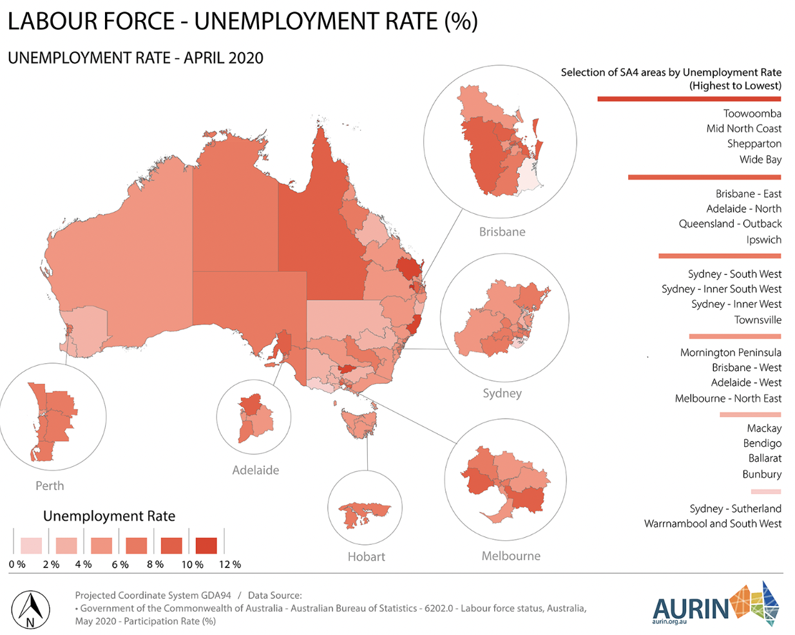

]


---
# Research Aim 

__The overall research aim is to evaluate the employment effects of COVID-19 via developing a model for the two-digit subsectors (<u>86 totally</u>) .  __ 

<small style="font-size:14pt"> I'm also trying to solve the following tasks: </small>


+ To construct a time series multivariate model of employment in 86 subsectors of the Australian economy. 

--

+ To use this model to conduct a counterfactual analysis 

--

+ To use this model to determine which sectors have the highest impact (or positive spillover) on employment growth. 


---
# Review of Literature 
# Sectoral studies of COVID-19:


.font_my_2[

+ At a worldwide level, International Labor Organisation provided some initial estimates and concluded the "Accommodation & Food services", "Real Estate, Business,& Administrative Activities", "Manufacturing", and "Wholesale & Retail Trade" as high risk sectors. 
 

+ In US, <small style="font-size:13pt">Ludvigson,Ma, and Ng (2020)</small> developed a costly disaster model to translate the impacts of deadly disasters in recent US history and modeled as shocks to predict the COVID-19 influences.  <small style="font-size:13pt">Gregory, Menzio, and Wiczer (2020)</small> expand some Model-based analysis of the disaggregate impacts of 20 sectors. 


+ In France, <small style="font-size:13pt">Barrot, Grassi and Sauvagnat (2020)</small> estimated the impacts at sectoral level. They then use a production network model to estimate the drop of total GDP and sectoral performances. 


]

--
### Limitation:

However, not many studies have done in Australia (as a small open economy nothing like US, Europe).


---
# Review of Literature

<br>

<br>

.grid[
.font_my_2[

### An Aussie story begins:
+ Anderson et al. (2020) conducted a multivariate time series Bayesian VARX model for 19  broad sectors in Australia. Their research conducted in 2020 at the time full of uncertainty. Therefore, they applied an "conditional forecasting" method to simulate different scenarios for the sectoral employment in Australia during the pandemic. 


### Limitation:

Some useful information about macroeconomic analysis may lose due to the differences in 19 (broad level) sectors and 86 (Two-digit level) sectors. 


]

.font_my_2[

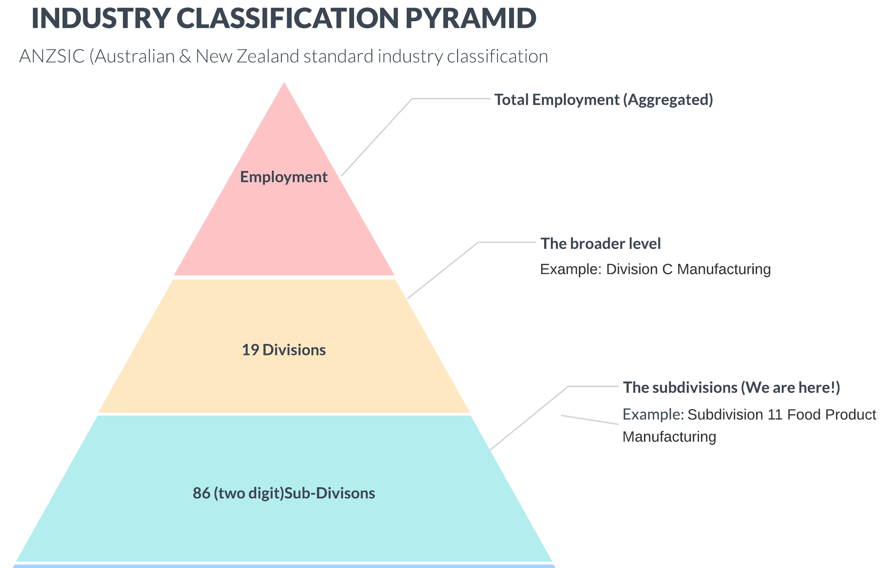

]

]


---

# Exploratory Data Analysis


+ **Don't judge them by their appearances**


<small style="font-size:13pt">Here is the reason why we expand Anderson et al. (2020) to a two-digit level. See the differences :-) </small> <small style="font-size:13pt">If we stimulate a industry at a broad sector level, our policy may **lack of efficiency**. </small>


<br>

.grid[

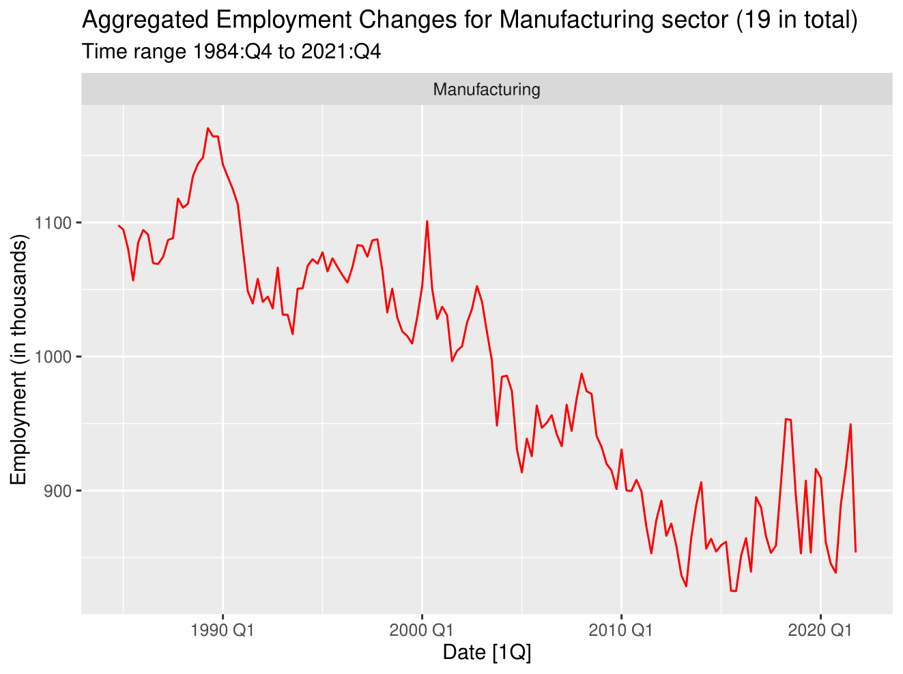

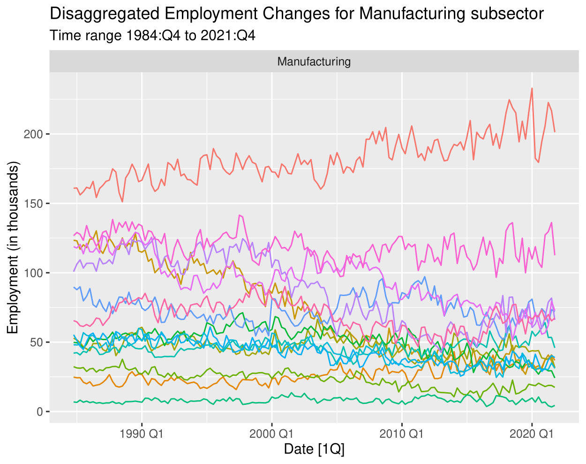


]


<br>


---
# Project Design (Data)

## Data Sources: 

<br>

.font_my_2[

+ Number of Employment by Industry at subdivision (i.e. subsector) level: Retrived from [ABS Labour Force, Australia, Detailed](https://www.abs.gov.au/statistics/labour/employment-and-unemployment/labour-force-australia-detailed/latest-release)

]


<br>

## Supplementary Data 

<br>

.font_my[

+ **Total Labour Force**: Australian Bureau of Statistics ABS(2022a)

+ **Unemployment Rate**: Australian Bureau of Statistics ABS(2022b)

]


---
#Project Design (Data)

## Data Wrangling 

<br>

.font_my[

①: Some small or new subsectors(e.g. Internet Publishing) have no historical records of employment, we combine them with similar sectors that are "non-zero".]

--

<br>


.font_my[

②: An **logarithm** and a **seasonal difference ** will be conducted to eliminate the seasonality and make it **stationary**, which will make it easier to conduct further steps. 

]


---
# Project Design (Data)


<br>

+ **Why don't I use the seasonally adjusted data ?**
--
.font_my_2[

+ Seasonally adjusted sectoral data in ABS do not add up seasonally adjusted total employment. Due to the seasonality of post-COVID data have changed. I CANNOT make reliable evaluation !!! 

+ All new changes are expressed in terms of the raw figures.  
]

--

<br>


+ **What about the non-classified Data?**

--
.font_my_2[

+ We found there is no further direction to classify the data. Therefore, to make sure the individual dynamics are consistent, we will not consider them in our research. 


]


---

# Project Design (Modelling)

+ **Vector Autoregression** with **Exogenous Variable** Model (VARX) is a useful model to estimate the dynamic behaviors of the relationship between variables in a statistically coherent way. <small style="font-size:14pt">(Anderson et al.,2020;Litterman, 1986;Bańbura,Giannone,&Reichlin,2010)</small>


$$\textbf{y}_t=\textbf{c}+\textbf{A}_1 \textbf{y}_{t-1}+\bf{\Gamma}\textbf{x}_{t-1}+\bf{u}_t$$
.font_small[
**where:**  
]


.font_my_2[

+ $\bf{y}_t$ is an $84\times1$ vector of two-digit subsectoral employment growth rate at time $t$ with $\bf{A}_{1}$ are $84\times84$ parameter matrices. There are one lag of growth rate due to the high dimensionality and small sample size. 

+ $x_{t-1}$ is a scalar of one lag of the growth rate of total employment with $\bf{\Gamma}$ is $84\times1$ parameter matrices, which act as economy-wide factors. 

+ Reduced form errors $\bf{u}_t \sim N(0,\bf{\Sigma})$. 

]


---
class:center
# Project Design (Modelling)
##Bayesian Inference in VARX modelling

.font_my_2[
+ We have 7224 parameter to estimate (frequentist is not suitable). $\bf{\beta}$ contains $\bf{c}$, $\bf{A_1}$ and $\bf{\Gamma_1}$

+ **Bayesian inference** derives the posterior probability as a consequence of two antecedents: a *Prior Probability* and a *Likelihood Function* derived based on the observed data.]

<br>

--

.font_my_2[
+ We can think of Bayesian Estimation as $Posterior = Likelihood\times Prior$ ]

$$f(\bf{\beta}|y)\propto L(\beta|y)f(\beta)$$
.font_small[
$f(\bf{\beta})$ = the **prior** pdf for $\bf{\beta}$;expresses prior uncertainty about the $\beta$

$f(\bf{\beta}|y)$ = the **posterior** pdf of $\bf{\beta}$; expresses uncertainty about $\beta$ **after** having observed the data $\bf{y}$ (or **conditional** on the observed data)
]

.font_my[

+ We can bring our beliefs (priors) to the parameter. After seeing the data (likelihood), we get the posterior by combining the likelihood and the prior together.

]


---
# Project Design (Prior Selection)

<br>

.font_my[
<b>Aim</b>: We use Minnesota prior to shrink the unrestricted model towards a random walk, thereby reducing the parameter uncertainty and improving forecast accuracy. <small style="font-size:11pt">(Anderson et al.,2020;Litterman,    1986;Bańbura,Giannone,&Reichlin,2010;Karlsson,2013)</small>  

]


.font_my[

<br>

<b>Benefits</b>:  
 
  a. Eliminate <u>high-dimensionality</u> curse. 
  
  b.  It makes the most <u>recent lag</u> provide more information than distant lags. 
  
  c. It makes <u>own lags</u> explain more than the lags of other variables.
  
]

<br>
  
.font_my_2[
<b>Apply</b> : I will apply it in the BVAR system by creating a **Normal- Inverse-Wishart prior** (which *retain the principal of Minnesota prior*) and then adding dummy observations to put the posterior moments of Normal IW prior inside our BVAR system. <small style="font-size:11pt">(Bańbura,Giannone, and Reichlin (2010))</small> 

]

---

# Project Design (Details)

<b>Mean</b>:

--
.font_my_2[
 $$E[a_{1}^{jk}] = E[\gamma_{1}^j]=0$$

] 

--


**Variances**:

--
.font_my_2[
 For the lag of growth rate:

$$Var[a_1^{jk}]=\lambda^2,j=k$$


$$Var[a_1^{jk}]= \frac{\lambda^2\sigma^2_j}{\sigma^2_k}, otherwise$$

 
 For the lag of total employment:

$$Var[\gamma_1^{j}]=\frac{\lambda^2\sigma^2_j}{\sigma^2_e}$$
]


.font_small[

<u><b>Note</b></u>: $\lambda$ control the overall tightness(variance of prior distribution) and governs the relative importance of the prior beliefs *w.r.t* the information contained in the data;  $\frac{\sigma_j}{\sigma_k}$ adjusts for different scale and variability. 


]


 <!-- If $\lambda\rightarrow0$, we can see that the prior assumption is influential, which means that the posterior getting closer to the prior, so the data have no influence on the estimates. On the contrary, if $\lambda\rightarrow\infty$, the posterior expectations will approach to ordinary least squares (OLS) estimates. In many macroeconomic VAR forecasting, data are presented in a large dimension. As the dimension increases, we want to shrink more in order to avoid the over-fitting [@de2008] -->


---
# Selection of hyperparameter $\lambda$
# A new approach in selecting hyperparameter $\lambda$

.font_my_2[

+ Conventional error measurements (e.g. MAE, MSE or MAPE) are no longer robust when sizes of subsectors are small with various scales. 

]

.font_my_2[

+ We minimising a new error measurement "Root Mean Squared Forecast Error" via an out-of-sample forecasting experiment algorithm. ]


$$RMSFE^{\lambda}_{i}=\sqrt{\frac{1}{T_e-T_b-1}\Sigma^{T_{e}-1}_{T=T_{b}}({y}_{i,T+1|T}^{\lambda}-y_{i,T+1})^2}$$

<br>

.font_small[ 

+ where ${y}_{i,T+1|T}^{\lambda}$ is defined as the $1$-th steps ahead forecast given the information up to time $T$ and $y_{i,T+1}$ is the actual data for the $1$-th steps ahead forecast. Here, $\lambda$ stands for the evaluated RMSFE, conditioned on the hyperparameter $\lambda$. 

]


---
class:center
# Selection of hyperparameter $\lambda$
# Diagram of the grid search

<br>

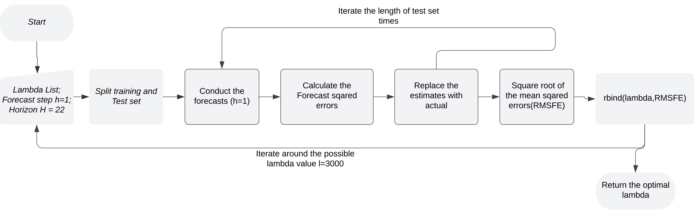

<br>
.font_my_2[

+ From 3000 different combinations $\lambda$ from 0.0001 to 0.3, we found the $\lambda=0.0808$ has the lowest RMFSE. 


] 

---
# Empirical Results (Sectoral Multiplier Analysis)


.grid[

.font_my_2[

<br>


#### Background

The total employment growth is: 

$$GR_T=\sum_{j=1}^{84} w_j\times {GR}_j$$

<small style="font-size:12pt">(where $w_j$ is the share of employment of two-digit sector $j$ in the total employment and  $GR_j$  is the growth rate in employment of two-digit sector j and  $GR_T$  is the growth rate in total employment )</small>

📈 Due to the interconnection of macroeconomic two-digit subsectors, when a two-digit subsector $j$ has an increase in employment, in the long run, it may have spillover effect onto other two-digit subsectors, especially those that have high connections with the two-digit subsector $j$. 

]


.font_my_2[

<br>

<br>

<ul><b>Why is it useful?</b></ul>

+ This will take the <u>structure of industries</u> into consideration, which is more closer to the reality. It also allows us to assess the damage of COVID-19 to these industries.  

+ This will help us to evaluate the efficiency of policies. For example, if policies simulate these subsectors, there will be a *bonus* and then we can say <u>"a dollar to these high spillover industries is more valuable than a dollar"</u>

]
]


---
# Empirical Results (Sectoral Multiplier Analysis)
## Long run employment multipliers


```{r out.width="100%", fig.align='center'}
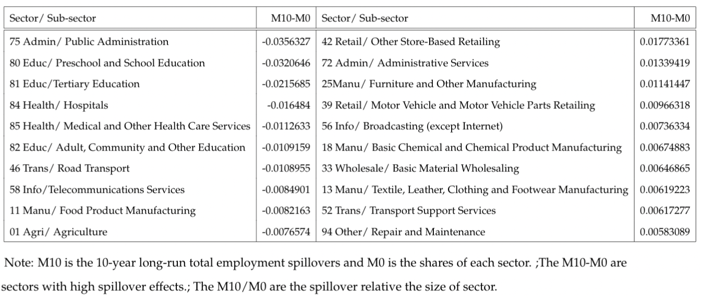
```


.font_my_2[ 
+ 10 subsectors generate strongest positive spillovers (right) and biggest negative spillovers (left).

]


 
 
---
# Empirical Results (Evaluation after COVID-19)
## Losses of total employment after COVID-19


```{r out.width="85%", fig.align='center'}
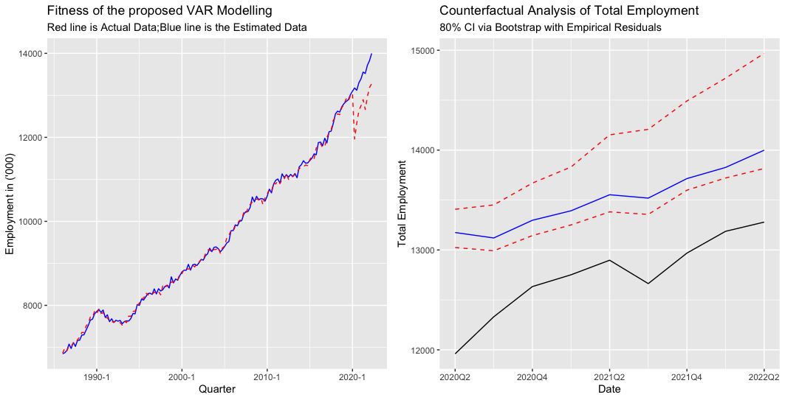
```

--
.font_my_2[

+ Huge losses of employment compare with the no-COVID scenario.

+ The trend is essentially parallel with the exception of 2021 Q2 to Q4 (growth rate recovered). 

]


---
# Empirical Results (Evaluation after COVID-19)
## Changes of year-on-year growth rate


```{r out.width="60%", fig.align='center'}
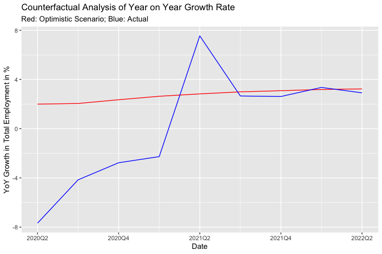
```

--

.font_my_2[

+ The year-on-year growth gradually recovered after the shock. 

+ The impact of COVID-19 cannot recover in a short-term (unless there is a higher year-on-year growth in the future.) 

]


---
# Empirical Results (Unemployment Rate)


.grid[

.font_my_2[

<br>


<ul><b>Historically Lowest Unemployment:</b></ul>

Australia has recorded the lowest unemployment level in 48 years. What is the underlying of this when <b>I</b> said we have not recovered yet? 


$$U_{emp}=\frac{T_L-T_E}{T_L}$$
.font_small[
where $U_{emp}$ is the unemployment rate; $T_L$ is the total labour force; $T_E$ total employed people.
]

<ul><b>Drives of low unemployment rate:</b></ul> 

+ Lower labour force. 

+ Higher Employed People. 


]
.font_my_2[

<br>

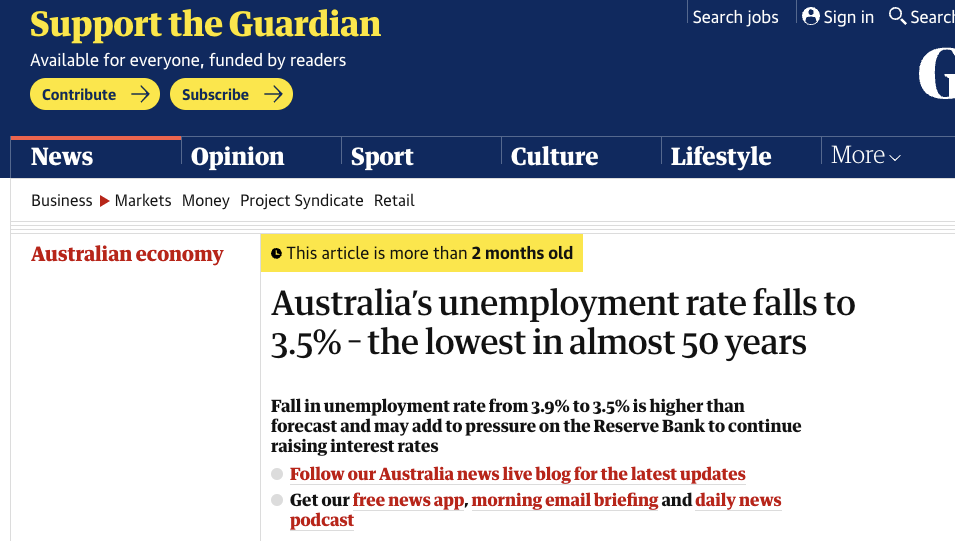
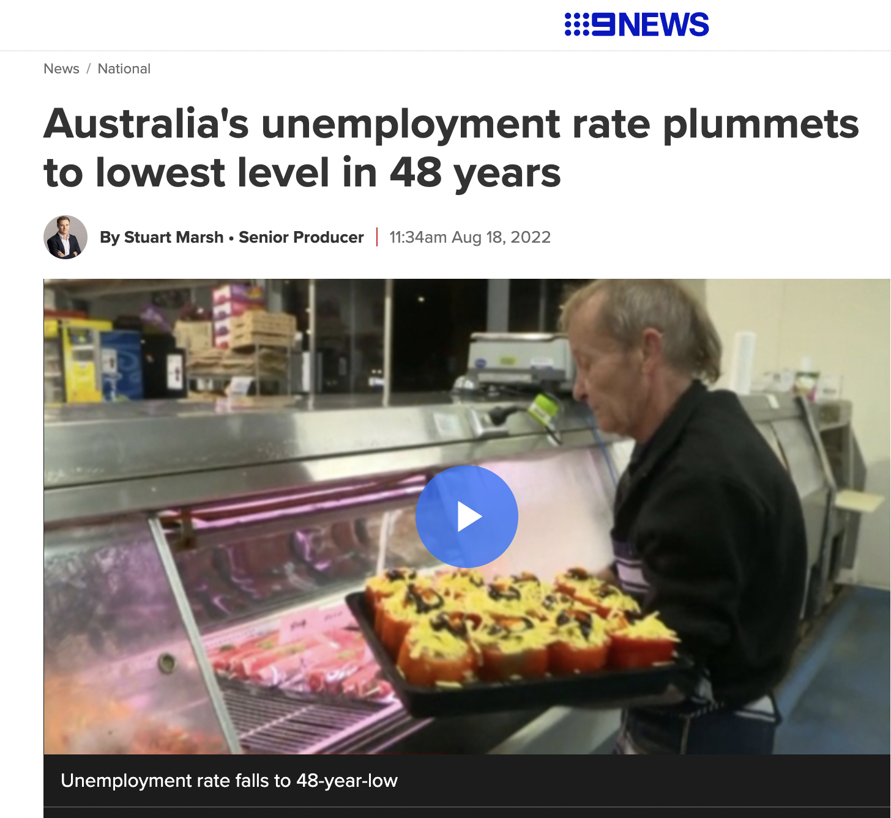

]

]


---
# Empirical Results (Unemployment Rate)


```{r out.width="90%", fig.align='center'}
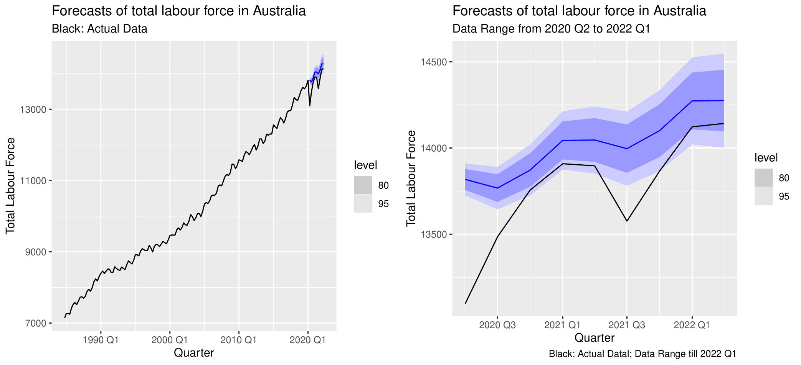
```

.font_small[Note: The forecasts of total labour force are generated via stepwise `ARIMA` function in R package `fpp3 0.4.0` by Rob Hyndman]


.font_my_2[

+ We see that the total labour force has declined significantly compare with no-COVID case. 

+ The lowest unemployment rate is mainly driven by the decline of **total labour force**. 


]


---
# Empirical Results (Unemployment Rate)


```{r out.width="80%", fig.align='center'}
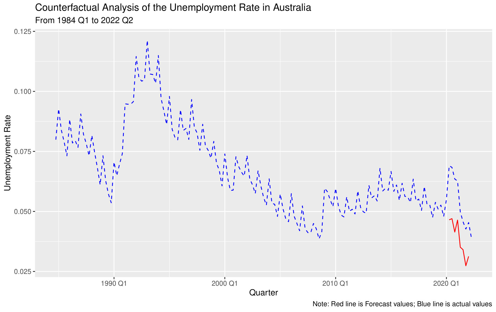
```

.font_my_2[

1. The finding suggests the low unemployment rate would achieve lowest even without the COVID. 

2. The stimulus policies during the COVID do not contribute the most for the low unemployment rate. 

<!-- if u think it's government stimulate the economy during covid is wrong  -->


]


---
# Discussions⌕

**Policy Implications**

<br>

.font_my[

📈 More appropriate policies should stimulate those high-spillover subsectors in a disaggregated level if government want to increase the number of employment more effeciently. 

<br>

👷The COVID-19 has affected the total employment and the labour force participation. Policies should focus on both employment and total labour force at this stage.
 
<br>
📉 Government should be aware that relatively low unemployment rate may reflect the labour shortage (E.g. Reforming the immigration system or issuing more WHV to attract more labour overseas).

]
---

# Discussions⌕
## Summary


+  Bayesian VAR model is used to estimate the no-COVID scenario.

<br>

--
+  Algorithm to select the best hyperparameter for the Minnesota prior  applied in the proposed BVAR.

<br>

--
+  Simulate the disaggregated subsectoral spillovers via impulse responses. 

<br>

--
+  A complete evaluation of both the impacts of COVID-19 and discover the underlying reason of low unemployment rate after the COVID-19. 


---
# Extensions

<br>

🤖 To improve the forecast accuracy, machine learning algorithms or combination forecasts can be considered for accurate and interpretable forecasts. 

<br>
--

👨‍💻 To make our analysis more broad and easily accessible by researchers or government. An interactive shiny application can be implemented to give a more accessible way and thus benefit more people.

<br>
--

♾ Bring more hierarchies to our analysis and make forecasts coherent using the hierarchical forecasting methods. 


<br>
---
class: center
# 👨‍🏫 SPECIAL 👨‍💻 THANKS 👩‍🏫
<br>

<br>


.monash-blue[I would like to gratitude my supervisor, 

**Farshid Vahid**, for your patient and selfless guidance.]

<br>

.monash-blue[I would also appreciate **Heather Anderson** for your devoted care along the journey.]

<br>

.monash-blue[Special thanks to  **Benjamin Wong** for offering kind supports and the MATLAB packages.]


---
<b>Figure Source</b>
.font_small[

covid image1: https://humanrights.gov.au/our-work/childrens-rights/publications/impacts-covid-19-children-and-young-people-who-contact-kids

covid image2: https://aurin.org.au/covid-and-employment/

covid image3: https://www.forbes.com/sites/advisor/2020/04/14/coronavirus-concerns-will-less-income-or-job-loss-hurt-your-credit-score/?sh=648c744e4dc4

Front page Data Source: The first year of COVID-19 in Australia: direct and indirect health effects, Summary - Australian Institute of Health and Welfare. (2022). Retrieved 8 May 2022, from https://www.aihw.gov.au/reports/burden-of-disease/the-first-year-of-covid-19-in-australia/summary

fence:https://canberraweekly.com.au/best-fencing-contractors/

window maker: https://www.bizjournals.com/tampabay/news/2020/02/05/pgt-completes-92m-acquisition-of-tampa-based-door.html

Unemplyment: Marsh, S. (2022). Australia's unemployment rate plummets to lowest level in 48 years. Retrieved 2 October 2022, from https://www.9news.com.au/national/australia-unemployment-rate-july-2022-lowest-rate-since-august-1974/d16e2bac-c9f1-435f-ad25-cb2964d292f0 


]

<b>Major references</b>

.font_small[

ABS. (2021). One year of covid-19: Aussie jobs, business and the economy. Retrieved April 29, 2022, from https://www.abs.gov.au/articles/one-year-covid-19-aussie-jobs-business- and-economy

Anderson, H, Caggiano, G, Vahid, F, & Wong, B. (2020). Sectoral employment dynamics in australia and the covid-19 pandemic. Australian Economic Review, 53(3), 402–414.


Bańbura, M, Giannone, D, & Reichlin, L. (2010). Large bayesian vector auto regressions. Journal of applied Econometrics, 25(1), 71–92.


International Labour Organization 2020. ILO Monitor: Covid‐19 and the World of Work.

Karlsson, S. (2013). Forecasting with Bayesian vector autoregression. Handbook of economic forecasting, 2, 791-897.

Kadiyala, KR, & Karlsson, S. (1997). Numerical methods for estimation and inference in bayesian var-models. Journal of Applied Econometrics, 12(2), 99–132.

Litterman, RB. (1986). Forecasting with bayesian vector autoregressions—five years of experience.Journal of Business & Economic Statistics, 4(1), 25–38.

]
---


```{r endslide, child="components/endslide.Rmd"}
```


---
class: center
#APPENDIX (Bayesian VAR)

.font_my_2[

$$\begin{align}
\textbf{y}_t&=\textbf{c}+\textbf{A}_1 \textbf{y}_{t-1}+\bf{\Gamma}_1\textbf{x}_{t-1}+\bf{u}_t\\
&=
\begin{bmatrix}
c_1\\
\vdots\\
c_n
\end{bmatrix}
+
\begin{bmatrix}
a_1^{11}&\cdots&a_1^{1n}&\gamma_1^{1}\\
\vdots&\ddots&\vdots&\vdots\\
a_1^{n1}&\cdots&a_1^{nn}&\gamma_1^n&\\
\end{bmatrix}
\begin{bmatrix}
\bf{y}_{t-1}\\
x_{t-1}\\
\end{bmatrix}\\
&+
\begin{bmatrix}
u_{1,t}\\
\vdots\\
u_{n,t}
\end{bmatrix}\\
\end{align}$$
]

.font_my_2[
+ where $E(\bf{u}_t\bf{u}'_t)=\bf{\Sigma}$ and $E(\bf{u}_t\bf{u'}_{t-1})=0$. The $n$ represent the number of sectors (or in our case will be 84) and $c$ represents the vector of constants. There are one lag (p=1) included for the total employment $(x_{t-1})$ as predetermined variable at time $t$.

]
---
# Appendix (Minnesota Prior)

.font_my_2[
$$\begin{aligned}\label{eq:1}
&E[a_{j}^{jk}] = E[\gamma_{i}^j]=0\\
\\
&Var[a_j^{jk}]= 
\begin{cases}
\frac{\lambda^2}{i^2},&j=k\\
\frac{\lambda^2}{i^2}\frac{\sigma^2_{j}}{\sigma^2_k},& otherwise
\end{cases}\\
\\
&Var[\gamma_i^{j}]=\frac{\lambda^2}{i^2}\frac{\sigma^2_{j}}{\sigma^2_e}
\end{aligned}$$
]

.font_my_2[

+ The degree of shrinkage is governed by $\lambda$, $\frac{1}{i^2}$ to down-weight more distant lags and the $\frac{\sigma_j^2}{\sigma_k^2}$ adjusts for different scale of the data. $\sigma^2_e$ is the variance after fitting an AR model on total employment growth. 

]


---
# Our system 
.font_my_2[
$$\begin{aligned}\underbrace{Y}_{T\times n} = \underbrace{XB}_{T\times k \times k \times n} \ +\underbrace{U}_{T\times n}\end{aligned}$$

where $\bf{Y}=(Y_1,\cdots,Y_T)'$;and $\bf{X}=(X_1,\cdots,X_T)'$ with $X_t=(Y'_{t-1},x_{t-1},1)'$ and $u=(u_1,\cdots,u_T')$ . 

]

**Normal-Inverse-Wishart Prior** 

.font_my_2[
The Normal-Inverse-Wishart Prior has the form 

$$\begin{aligned}
&\bf{vec(\mathbf{B})}|\bf{\Sigma}\sim N(\bf{vec}(\bf{B_0}),\Sigma\otimes\Omega_0)\ \\
&\bf{\Sigma}\sim\mathbf{IW}(\bf{S_0},a_0)\end{aligned}$$

where the prior parameters $\mathbf{\beta}_0$ and $\bf{\Omega_0}$, $\bf{S_0}$  and $a_0$ such that they are consistent with the Minnesota prior we mentioned before and the expectation of $\bf{\Sigma}$ being $diag(\sigma_1^2,\cdots,\sigma_n^2)$.
]
---
# Normal-Inverse-Wishart Prior (Set Up Dummies)

.font_my_2[
$$\begin{aligned}
\bf{Y_d}&=
\begin{pmatrix}
\bf0_{np+p,n}\\
\bf diag(\bf{\sigma_1,\cdots,\sigma_n})\\
\bf0_{1\times n}
\end{pmatrix}\\
\end{aligned}$$


$$\begin{aligned}
\bf{X_d}&=
\begin{pmatrix}
\bf{J_p}\otimes diag(\frac{\sigma_1}{\lambda}\cdots\frac{\sigma_n}{\lambda},\frac{\sigma_e}{\lambda})&\bf0_{(np+p)\times1}\\
\bf 0_{n,np+p}&\bf 0_{n\times1}
\\
\bf 0_{1,np+p}&\bf \epsilon
\end{pmatrix}
\end{aligned}$$

]

.font_my_2[


<br>


where:
$\bf{J_p}=diag(1,\cdots,p)$; $\bf{S_0}=(Y_d-X_d\times B_0)'(Y_d-X_dB_0)$, $\bf{B_0}=(X_d'X_d)^{-1}X_dY_d$, $\bf{\Omega_0}=(X_d'X_d)^{-1}$ and  $a_0=T_d-np-p-1$; $\epsilon$ is a small number to impose an uniformative and diffused prior on the constants. 


<br>

Here, both $\bf{Y}_d$ and $\bf{X}_d$ are the dummy observations we set 
where $T_d$ is the number of rows for both $\bf{Y}_d$ and $\bf{X}_d$.
]

---
# Normal-Inverse-Wishart Prior 


## We can get:

.font_my[

$$\begin{aligned}
\bf{Y^*}=\bf{X^*}\bf{B}+\bf{\mu}^*\\
\end{aligned}$$

where : 


$$\begin{aligned}
\bf{Y^*}=[\bf{Y'},\bf{Y'_d}]';\ \bf{X^*}=[\bf{X'},\bf{X'_d}]';\ \bf{\mu^*}=[\bf{\mu'},\bf{\mu'_d}]'
\end{aligned}$$

]

.font_my_2[
Then we can estimate the BVAR by conducting an least square regression of $Y^*$ on $X^*$ . The posterior distribution then have the form of

$$\begin{align}
&\bf{vec(\mathbf{B})}|\Sigma,Y\sim N(vec(\bf{\tilde{B}}),\Sigma\otimes(\bf{X^*}'\bf{X^*})^{-1})\ and\\
&\bf{\Sigma|Y}\sim\mathbf{IW}(\bf{\tilde\Sigma},T_d+T-np+2)
\end{align}$$


where $\bf{\tilde{B}} =(X*'X*)^{-1}X^{*'}Y^*$ and $\bf{\tilde\Sigma}=(\bf{Y^*}-\bf{X^*}\bf{\tilde{B}})'(\bf{Y^*}-\bf{X^*}\bf{\tilde{B}})$

]


---
# Further Details 

.font_small[
Groups of 42 Other Store-Based Retailing

421 Furniture, Floor Coverings, Houseware and Textile Goods Retailing

422 Electrical and Electronic Goods Retailing

423 Hardware, Building and Garden Supplies Retailing

424 Recreational Goods Retailing

425 Clothing, Footwear and Personal Accessory Retailing

426 Department Stores

427 Pharmaceutical and Other Store-Based Retailing

] 

.font_small[

Groups of 72 Administrative Services


721 Employment Services

722 Travel Agency and Tour Arrangement Services

729 Other Administrative Services


]

